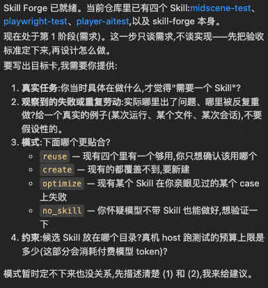
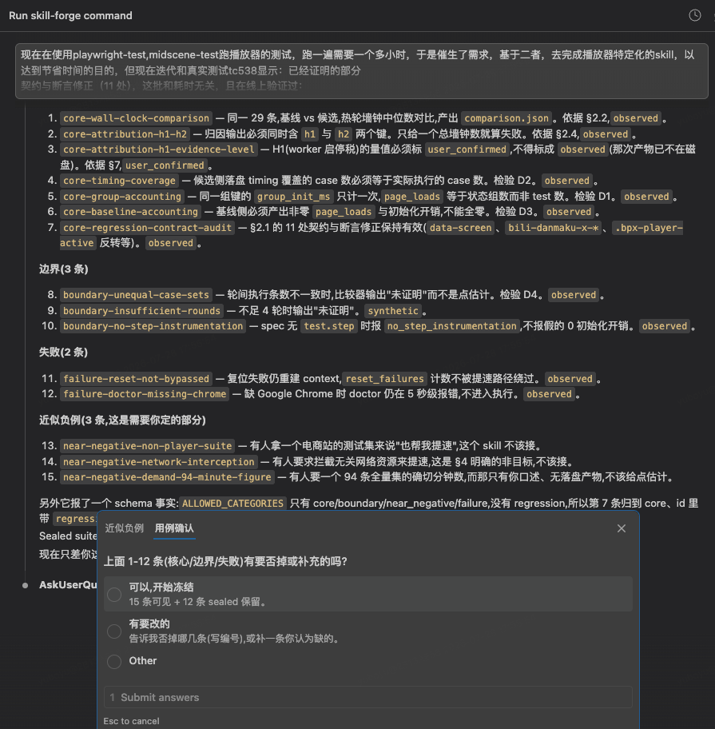

# Skill Forge

English · [中文](README.zh-CN.md)

Build the smallest Skill that real task evidence justifies, retain the version that is actually better, and say exactly what the evidence does and does not prove.

> **Skill Forge is a creation and optimization system that prevents false improvement, test accommodation, and overstated claims in Skills.**

It is neither a prompt template for quickly drafting a Skill nor a release gate that only checks the finished package. Skill Forge wraps authoring in an evidence loop: decide whether a Skill is needed, freeze candidate-neutral acceptance cases, preserve the baseline, build and compare the candidate, keep the better version, and bound the final claims.

It stops at a candidate handoff. Installation, publication, commits, and release remain separate, explicitly authorized actions.

Python 3.10+, standard library only. No network calls, no dependencies.

## Why use Skill Forge instead of only a Skill creator?

A creator and Skill Forge answer different questions:

| | Skill creator | Skill Forge |
|---|---|---|
| Primary question | How should this Skill be written? | Is a Skill needed, and is this candidate genuinely better? |
| Starting point | An authoring request | A real task, observed failure, or repeated cost |
| Evaluation | Usually review the generated Skill | Freeze cases before the candidate, then compare raw outcomes |
| Baseline | Optional | Immutable for optimization; no-Skill is also a real baseline |
| Failure outcome | Revise the draft | `keep_baseline`, `no_skill`, `reject_candidate`, or `inconclusive` are valid results |
| Claim discipline | Describes what was built | Separates proven, disproven, unverified, not run, and unobservable claims |

They are complementary. A creator can be used inside the drafting stage; Skill Forge decides whether that draft deserves to survive. A release gate begins after a candidate exists. Skill Forge starts before implementation and ends before installation or publication.

Its distinctive value is not producing more files. It is preserving the causal chain:

```text
real task -> frozen acceptance standard -> isolated candidate
          -> comparable observations -> evidence-bounded decision
```

## Real-machine result: same Opus 5, different guidance

An earlier Skill Forge version was used to optimize `player-aitest`. The baseline and candidate were generated with the same **Opus 5** model; the controlled difference was whether the model worked through the Skill Forge optimization constraints.

The explicit optimization target was **execution speed**. Accuracy was not added as a parallel target for the model to chase. While pursuing speed, Skill Forge's acceptance and evidence process exposed correctness defects, and the candidate repaired them without being separately instructed to optimize accuracy. The accuracy/stability change below is therefore a discovered secondary gain, not the premise used to define success.

The live run used 29 identical player cases on `www.bilibili.com` with system Chrome 150. Each side ran four rounds (one cold and three hot), with zero skipped cases.

| Observed result | Baseline | Skill Forge candidate | Change |
|---|---:|---:|---:|
| Hot-run median wall clock | 337.5 s | 117.4 s | **-220.1 s / -65.2%** |
| Effective throughput | 0.086 cases/s | 0.247 cases/s | **2.87x** |
| Passes across 4 rounds | 105 / 116 | 107 / 116 | **+2 passes / +1.7 pp** |
| Median passes in a hot round | 26 / 29 | 27 / 29 | **+1 case / +3.4 pp** |
| Skipped cases | 0 | 0 | Same executed case set |

The primary result is the **65.2% execution-time reduction**. The higher pass counts are an additional observed result of the self-initiated repairs made during optimization. Because both sides used Opus 5, the result is evidence that the Skill's constraints improved what the same underlying model produced, rather than evidence that a stronger model was substituted.

The optimization also exposed concrete quality defects instead of merely shortening the run: premature control probes were being recorded as skipped tests, an unplayable-video terminal state could never satisfy `waitPlayerReady`, and the original seek predicate could pass before seeking began.

The claim boundary matters: this run proves the result for these 29 cases and this live environment. It does **not** yet quantify natural-language-to-spec generation time, all 94 automated cases, higher worker counts, automatic routing, or generalization to other Skills. That boundary is part of the result, not a disclaimer added afterward.

### What the run looked like



*Goal and mode freeze: Skill Forge asks for the real task, observed failure, mode, and constraints before discussing implementation.*



*Case review: the run presents core, boundary, failure, and near-negative cases before the candidate is built, then pauses for the user to confirm or amend them.*

## Case study: multi-source weekly-report Skill

Skill Forge was also used to optimize `comprehensive-summary`, a Skill that collects multiple sources and produces a work-week report. This optimization targeted the Skill's **triggering, workflow, and authorization contracts**. It did not modify the underlying collection, upload, or business-integration code.

| Observed result | Before | After | Change |
|---|---:|---:|---:|
| Skill Forge structural errors | 1 | 0 | Identity check passed |
| Frozen-suite full-case passes | 0 / 7 | 2 / 7 | **+28.6 pp** |
| Expected-field matches | 20 / 58 (34.5%) | 49 / 58 (84.5%) | **+50.0 pp** |
| Mismatched fields | 38 | 9 | **-76.3%** |
| `SKILL.md` lines | 155 | 131 | **-15.5%** |
| `SKILL.md` bytes | 9,997 | 9,060 | **-9.4%** |
| Active instructions and metadata | 214 lines | 177 lines | **-17.3%** |
| UI metadata fields | 0 | 3 | Name, description, and default prompt added |
| Explicitly excluded false-trigger categories | 0 | 3 | Document summary, team summary, and generic calendar |
| Underlying business files changed | 0 / 20 | 0 / 20 | All 20 remained byte-identical |

The difference between **2/7 full-case passes** and **49/58 field matches** is intentional and important. Full cases use strict JSON equality, so one differently named nested field fails the entire case. The candidate corrected most expected behavior fields, but the remaining nine mismatches show that its output structures are not yet fully standardized.

The optimization made these changes without touching the 20 business implementation and configuration files:

- replaced the invalid `Comprehensive_Summary` identity with the discoverable `comprehensive-summary`;
- narrowed vague scheduling/task triggers to explicit Qingflow personal scheduling and excluded three adjacent request types;
- fixed a six-stage workflow: environment check, source collection, OKR extraction, AI matching, human review, and deterministic rendering;
- defined stable outcomes for invalid week numbers, missing credentials, and external-write states;
- required “show the exact target -> adjacent confirmation -> execute” for Qingflow create/delete, Zhizhi upload, tracking sync, and hook installation, with re-confirmation when the target changes;
- resolved commands through `SKILL_ROOT` instead of the current directory;
- moved Qingflow task types, TAPD subtask constraints, and environment variables into a conditionally loaded configuration reference;
- removed historical README material and added the three UI metadata fields.

This case proves improved structure, instruction consistency, trigger boundaries, and frozen-case behavior while preserving the underlying implementation bytes. It does **not** prove better collector/API performance, automatic routing, real GitLab/Qingflow/Zhizhi success rates, or production safety.

## Why it looks like this

Most Skill-authoring tooling fails in one of two ways. It either generates prose with no way to tell whether the result is better than nothing, or it grows a compliance layer so large that nobody completes a run.

Skill Forge takes a narrow position:

- **The acceptance cases are frozen in a different context than the candidate.** One agent writing both leaks its implementation plan into the tests, and ordering alone cannot prevent that because the leak precedes the freeze.
- **An unobservable check is not a failure.** A live host returns assistant prose, so exact-stdout expectations score `not_run`, never `failed`. Transport failures score `infra_error`. A network interruption must never produce a verdict about a candidate.
- **Stopping is a first-class result.** `keep_baseline` and `no_skill_supported_for_selected_cases` require evidence, exactly like adoption does.
- **Claims are capped in the report, not in prose.** Every report states its scope: selected cases only, not installed, not released, plus `fixture_host_only` and `no_held_out_cases` when they apply.

## Install

```bash
cp -r skill-forge ~/.claude/skills/skill-forge     # Claude Code
cp -r skill-forge ~/.codex/skills/skill-forge      # Codex
```

Invoke explicitly with `/skill-forge` or `$skill-forge`. It does not self-select from ordinary conversation.

To ship a verified tree instead of copying source, see [Packaging](#packaging).

## The workflow

```text
NEED -> FRAME -> FREEZE -> DRAFT/STAGE
     -> CHECK -> RUN -> SCORE -> DECIDE
     -> CAUSAL ITERATION -> HANDOFF
```

Pick one mode: `reuse`, `create`, `optimize`, or `no_skill`. Then freeze a goal card without copying the user's proposed implementation, freeze the suite, and only then build.

Full instructions are in [SKILL.md](SKILL.md). The references are loaded conditionally:

| Reference | Read it before |
|---|---|
| [authoring.md](references/authoring.md) | drafting or revising a candidate |
| [evaluation.md](references/evaluation.md) | designing cases or reading a decision |
| [evidence.md](references/evidence.md) | writing a suite or interpreting a report |
| [hosts.md](references/hosts.md) | running live Codex or Claude cases |
| [risk.md](references/risk.md) | the Skill has scripts, writes files, or touches credentials |

## Three-stage isolation

The suite is written by an agent that never sees the candidate, and the candidate is written by an agent that never sees the sealed cases:

```text
main conversation   clarify the goal -> requirements.md      (no implementation talk)
        |  passes requirements.md only
case subagent       suite.json + suite.sealed.json           (must ask about near-negatives)
        |  passes requirements.md + suite.json only
build subagent      the candidate
```

The holdout is enforced by not passing the file. There is no access-control contract to bypass, and no relabelling can turn a visible case into a sealed one afterwards.

Two agents from the same model share blind spots, so isolation prevents contamination but not ignorance. The user reviewing the proposed cases in plain language is the only heterogeneous check, and it is not optional. The case agent must also ask, once: *which requests could this Skill wrongly steal?* That answer is the user's alone.

## The suite

One strict JSON file per track, frozen before the candidate is observed. Baseline and candidate paths are passed to the runner, never stored in the suite.

```json
{
  "version": 1,
  "skill": "canonical-json",
  "mode": "optimize",
  "reps": 1,
  "cases": [
    {
      "id": "core-canonicalize",
      "source": "observed",
      "plane": "execution",
      "category": "core",
      "critical": true,
      "prompt": "Canonicalize payload.json into output.json.",
      "fixture": "cases/core-canonicalize",
      "expectations": [
        {"kind": "json_equals", "path": "output.json", "value": {"a": 1}}
      ]
    }
  ]
}
```

Every case carries a `source` label (`observed`, `user_confirmed`, `synthetic`, `assumed`) and a `category` (`core`, `boundary`, `failure`, `near_negative`). Critical execution cases require a strong deterministic expectation; `contains` alone will be rejected.

`plane: routing` cases measure whether a host selects the Skill without naming it, so the loader rejects a routing prompt that mentions the Skill name.

## Commands

```bash
# structure, hygiene, and AST risk hints
python3 scripts/check.py <candidate> --suite <suite.json>

# raw observations into a fresh run directory
python3 scripts/run.py --suite <suite.json> --configuration candidate \
  --skill-root <candidate> --host fixture --runs-dir <runs>

# reduce runs into a report; sealed evidence is a separate track
python3 scripts/score.py --suite <suite.json> --run <run> \
  [--sealed-suite <suite.sealed.json> --sealed-run <sealed-run>] \
  --output-dir <report>
```

`run.py` records observations only. `score.py` derives every verdict from those raw bytes; a caller cannot write `passed` into a result.

## What a host can actually observe

An expectation only decides a case when the chosen host can observe it. The suite stays host-neutral; the scorer resolves this from the run manifest.

| Expectation | `fixture` | live host |
|---|---|---|
| `json_equals`, `file_sha256`, `validator`, `file_exists` | objective | objective, needs `--policy workspace-write` |
| `stdout_contains`, `stdout_not_contains` | objective | indicative, never decides a case |
| `stdout_equals`, `exit_code`, `selected_skill` | objective | unobservable, scores `not_run` |

This matters more than it looks. In the current built-in generic runner, **no live host/policy combination produces positive execution evidence**: `read-only` leaves the model unable to read case inputs, `claude` + `workspace-write` is unimplemented, and routing telemetry does not exist on either host. Artifact expectations under `codex` + `workspace-write` are the intended path. This runner limitation does not erase separately recorded live experiments such as the `player-aitest` result above.

The fixture host replays frozen responses. It proves the pipeline works and nothing about a live model, which is why its reports carry `fixture_host_only`.

## Reading a report

Real output from `fixtures/optimize`, with the candidate regressed on the core case:

```text
Decision: `keep_baseline`

| Case                   | Plane     | Critical | Results                           |
| core-canonical-bytes   | execution | yes      | baseline=passed, candidate=failed |
| duplicate-key-boundary | execution | yes      | baseline=failed, candidate=passed |

## Claims

- Proven: fixture_pipeline_completed_on_selected_cases
- Disproven: candidate_gain_on_selected_cases
- Unverified: generalization_beyond_selected_cases, long_term_stability, runtime_safety,
  host_activation, behavior_on_held_out_cases
- Not run: automatic_routing
```

One case improved, but a critical case regressed, so the gain claim is disproven rather than averaged away. `fixture_host_only` is what `Proven` reduces to on the fixture host, and `behavior_on_held_out_cases` is unverified because no sealed suite was supplied.

A live run adds a section naming what could not be judged:

```text
## Not observable on this host
- `core-sort` / `stdout_equals`: a live host returns assistant prose, not exact task stdout
```

Decisions are `handoff_candidate`, `reject_candidate`, `adopt_candidate_for_selected_cases`, `keep_baseline`, `no_skill_supported_for_selected_cases`, `no_skill_not_supported_for_selected_cases`, or `inconclusive`.

Sealed results cap claims rather than replacing the decision: agreement proves `visible_decision_reproduced_on_held_out_cases`, contradiction disproves it, and the visible decision still stands. A contradiction is a real limit on generalization, not grounds for quietly reclassifying the candidate.

## Packaging

```bash
python3 scripts/package.py build --source . --host codex \
  --output <dist>/skill-forge --manifest <dist>/skill-forge.manifest.json
python3 scripts/package.py verify --candidate <dist>/skill-forge \
  --manifest <dist>/skill-forge.manifest.json --output <dist>/skill-forge-receipt.json
```

Ships `SKILL.md`, `VERSION`, `LICENSE`, `references/`, `scripts/`, plus `agents/` for Codex. Fixtures, tests, and the packaging script are authoring inputs and never ship.

The receipt is a byte binding with `claim_cap: byte_binding_only`. It proves the tree matches its manifest and that POSIX write bits were removed. It is not a signature, does not install anything, and does not prove a host loaded the Skill.

## Layout

```text
skill-forge/
├── SKILL.md              the workflow an agent follows
├── references/           conditional detail, one level deep
├── scripts/              check, run, score, package
├── fixtures/             create / optimize / no-skill pipeline fixtures
└── tests/                67 regressions over all four scripts
```

```bash
python3 -m unittest discover -s tests -v
```

## Limits

Stated plainly, because the reports state them too:

- The built-in generic runner currently yields no positive live-host execution evidence (see the observability table); separately instrumented live experiments remain valid within their recorded scope.
- Routing and near-negative trigger behavior cannot be tested; those cases stay `not_run`.
- Digests identify compared bytes and prevent accidental result mixing. They are not signatures and offer nothing against someone with write access to the same filesystem.
- `check.py` AST findings are planning hints. No findings is not a safety certificate, and non-Python scripts are recorded as unscanned rather than cleared.
- A passing suite covers the selected cases only. Generalization, long-term stability, host activation, and runtime safety stay unverified by design.
- Delivery stops at a handoff. Installation is `cp -r` plus a `.bak`, done by the user.

## License

MIT-NonCommercial. See [LICENSE](LICENSE).
