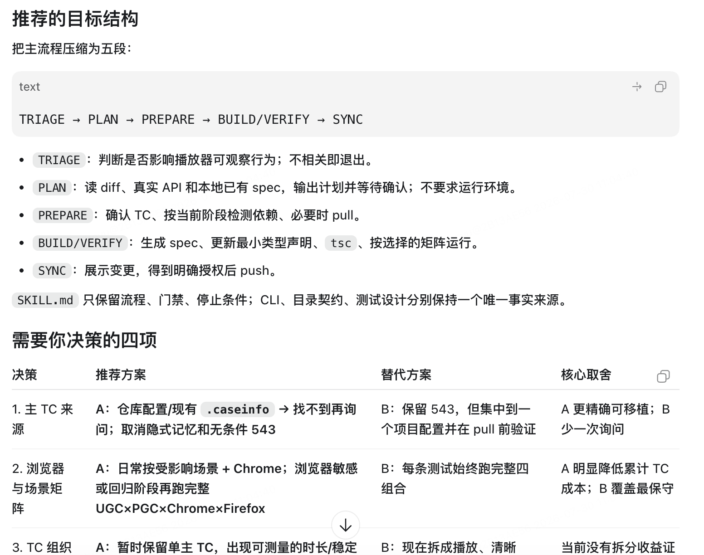
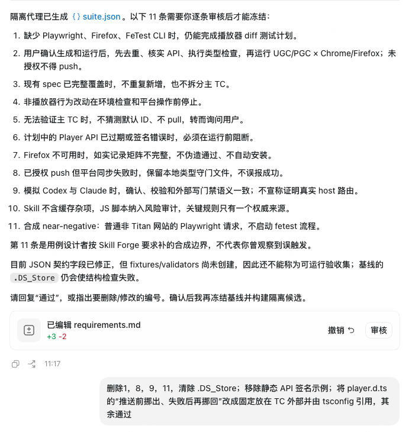

# Skill Forge — Optimize, Evaluate, Create

English · [中文](README.zh-CN.md)

**Optimize what exists. Test whether no Skill is enough. Create only what evidence justifies.**

> **Skill Forge is an evidence-driven system for creating, optimizing, and stopping work on reusable AI agent Skills.**

Skill Forge starts with the two expensive decisions that ordinary creators often skip: can an existing Skill be improved against a real failure, and does the selected task set need a Skill at all? When a Skill is justified, it builds a small candidate, compares it against the right baseline, and reports exactly what the evidence proves, disproves, or leaves unverified.

It is neither a prompt template for quickly drafting a Skill nor a release gate that only checks the finished package. It wraps authoring in an evidence loop: freeze candidate-neutral acceptance cases, preserve the baseline, build and compare the candidate, keep the better outcome, and bound the final claims.

It stops at a candidate handoff. Installation, publication, commits, and release remain separate, explicitly authorized actions.

Python 3.10+, standard library only. No network calls, no dependencies.

`VERSION` is the standalone project version source. The extracted baseline starts a new independent version line at `0.1.0`; only a clean, verified, tagged commit is a release.

## What Skill Forge decides

| Mode | What it protects | Evidence-bounded outcome |
|---|---|---|
| `optimize` | An immutable baseline and one observed failure | Adopt a candidate only when it improves the selected cases without a critical regression; otherwise `keep_baseline` |
| `no_skill` | A candidate-free baseline probe | `no_skill_supported_for_selected_cases` or `no_skill_not_supported_for_selected_cases` |
| `create` | A real need before implementation | Build a small candidate and hand it off or reject it; do not claim gain without a comparison |

If an adjacent Skill is already adequate, stop at the upstream `reuse` triage outcome instead of creating a duplicate. `reuse` is not an executable suite mode.

## Why use Skill Forge instead of only a Skill creator?

A creator and Skill Forge answer different questions:

| | Skill creator | Skill Forge |
|---|---|---|
| Primary question | How should this Skill be written? | Is a Skill needed, and is this candidate genuinely better? |
| Starting point | An authoring request | A real task, observed failure, or repeated cost |
| Evaluation | Usually review the generated Skill | Freeze cases before the candidate, then compare raw outcomes |
| Baseline | Optional | Immutable for optimization; no-Skill is also a real baseline |
| Failure outcome | Revise the draft | `keep_baseline`, `no_skill`, `reject_candidate`, or `inconclusive` are valid results |
| Claim discipline | Describes what was built | Separates proven, disproven, unverified, not run, and unobservable claims |

They are complementary. A creator can be used inside the drafting stage; Skill Forge decides whether that draft deserves to survive. A release gate begins after a candidate exists. Skill Forge starts before implementation and ends before installation or publication.

Its distinctive value is not producing more files. It is preserving the causal chain:

```text
real task -> frozen acceptance standard -> isolated candidate
          -> comparable observations -> evidence-bounded decision
```

## Real-machine result: same Opus 5, different guidance

An earlier Skill Forge version was used to optimize a player-regression Skill. The baseline and candidate were generated with the same **Opus 5** model; the controlled difference was whether the model worked through the Skill Forge optimization constraints.

The explicit optimization target was **execution speed**. Accuracy was not added as a parallel target for the model to chase. While pursuing speed, Skill Forge's acceptance and evidence process exposed correctness defects, and the candidate repaired them without being separately instructed to optimize accuracy. The accuracy/stability change below is therefore a discovered secondary gain, not the premise used to define success.

The live run used 29 identical player cases on a production video site with system Chrome 150. Each side ran four rounds (one cold and three hot), with zero skipped cases.

| Observed result | Baseline | Skill Forge candidate | Change |
|---|---:|---:|---:|
| Hot-run median wall clock | 337.5 s | 117.4 s | **-220.1 s / -65.2%** |
| Effective throughput | 0.086 cases/s | 0.247 cases/s | **2.87x** |
| Passes across 4 rounds | 105 / 116 | 107 / 116 | **+2 passes / +1.7 pp** |
| Median passes in a hot round | 26 / 29 | 27 / 29 | **+1 case / +3.4 pp** |
| Skipped cases | 0 | 0 | Same executed case set |

The run recorded a **65.2% execution-time reduction**, 2.87x throughput, and two additional passes across four rounds. Both sides used Opus 5.

The optimization also repaired premature control probes, unplayable-state handling, and a seek predicate that could pass before seeking began.

### Actual run screenshots


*The run collects the task, observed failure, mode, candidate location, and live-test budget before implementation.*


*Core, boundary, failure, and near-negative cases are presented for user confirmation before freezing.*

## Case study: multi-source weekly-report Skill

Skill Forge was also used to optimize a Skill that collects multiple sources and produces a work-week report. This optimization targeted the Skill's **triggering, workflow, and authorization contracts**. It did not modify the underlying collection, upload, or business-integration code.

| Observed result | Before | After | Change |
|---|---:|---:|---:|
| Skill Forge structural errors | 1 | 0 | Identity check passed |
| Frozen-suite full-case passes | 0 / 7 | 2 / 7 | **+28.6 pp** |
| Expected-field matches | 20 / 58 (34.5%) | 49 / 58 (84.5%) | **+50.0 pp** |
| Mismatched fields | 38 | 9 | **-76.3%** |
| `SKILL.md` lines | 155 | 131 | **-15.5%** |
| `SKILL.md` bytes | 9,997 | 9,060 | **-9.4%** |
| Active instructions and metadata | 214 lines | 177 lines | **-17.3%** |
| UI metadata fields | 0 | 3 | Name, description, and default prompt added |
| Explicitly excluded false-trigger categories | 0 | 3 | Document summary, team summary, and generic calendar |
| Underlying business files changed | 0 / 20 | 0 / 20 | All 20 remained byte-identical |

Full cases use strict JSON equality, so one differently named nested field fails the entire case. The result was **2/7 full-case passes**, **49/58 field matches**, and nine remaining mismatches.

The optimization made these changes without touching the 20 business implementation and configuration files:

- replaced an invalid underscore identity with a discoverable hyphenated identity;
- narrowed vague scheduling/task triggers to an explicit personal-scheduling scenario and excluded three adjacent request types;
- fixed a six-stage workflow: environment check, source collection, OKR extraction, AI matching, human review, and deterministic rendering;
- defined stable outcomes for invalid week numbers, missing credentials, and external-write states;
- required “show the exact target -> adjacent confirmation -> execute” for create/delete, upload, tracking sync, and hook installation, with re-confirmation when the target changes;
- resolved commands through `SKILL_ROOT` instead of the current directory;
- moved task types, subtask constraints, and environment variables into a conditionally loaded configuration reference;
- removed historical README material and added the three UI metadata fields.

The resulting candidate had zero structural errors, 49/58 expected-field matches, nine mismatched fields, three explicit false-trigger exclusions, and no changes to the 20 underlying business files.

## Case study: turning a test-automation manual into a workflow

Skill Forge reworked a long test-automation operation manual containing tutorials, fixed values, duplicated rules, and historical commands into a smaller process-oriented Skill. The candidate keeps all four required scenario/browser combinations.

| Size metric | Baseline | Candidate | Change |
|---|---:|---:|---:|
| Runtime files | 5 | 3 | **-40.0%** |
| Total lines | 643 | 212 | **-67.0%** |
| Total bytes | 44,192 | 13,211 | **-70.1%** |
| Main `SKILL.md` | 12,819 B | 8,818 B | **-31.2%** |
| References | 28,321 B | 4,393 B | **-84.5%** |
| Scripts | 3,052 B | 0 | **-100%** |

Most of the reduction came from references: three references and 436 lines became two conditionally loaded references and 94 lines. The JavaScript environment-check script was removed.

| Repeated or drifting content | Baseline | Candidate |
|---|---:|---:|
| Hard-coded primary case ID | 7 | **0** |
| Static API interface example | 1 set | **0** |
| Default spec filename | 9 | 1 |
| Shared type-declaration rules | 17 | 2 |
| Chrome rules | 18 | 6 |
| Firefox rules | 23 | 5 |
| Test CLI descriptions | 40 | 3 |
| Fixed `.claude` paths | 2 | **0** |

The candidate replaces these duplicates with one authoritative source per rule:

- determine the primary case from explicit user input, repository configuration, case metadata, or existing specs; stop and ask instead of guessing an ID;
- read API names, parameters, and return types from the current repository source; stop before browser execution when an API is absent or incompatible;
- keep the shared type declaration at one fixed repository location and reference it from the case configuration, eliminating move-before-push/move-back-after-push state;
- use `TRIAGE -> PLAN -> PREPARE -> BUILD/VERIFY -> SYNC`, with user confirmation before build and separate authorization before platform writes;
- keep host-independent behavior instead of hard-coded Claude/Codex installation paths.

The candidate removed the environment-check script, extensive testing-method tutorials, fixed platform values, historical CLI versions, copy-ready installation commands, and the original translated explanation. Current CLI help replaces duplicated historical commands.

The candidate passed structural checks, removed the generated metadata file, and eliminated the unscanned-script unknown. The formal behavior run recorded seven `not_run` cases and an **`inconclusive`** decision.

### Actual run screenshots



*The run presents the target workflow and the decisions that require user selection.*



*The proposed cases are reviewed and amended before the baseline and isolated candidate are built.*

## Why it looks like this

Most Skill-authoring tooling fails in one of two ways. It either generates prose with no way to tell whether the result is better than nothing, or it grows a compliance layer so large that nobody completes a run.

Skill Forge takes a narrow position:

- **The acceptance cases are frozen in a different context than the candidate.** One agent writing both leaks its implementation plan into the tests, and ordering alone cannot prevent that because the leak precedes the freeze.
- **An unobservable check is not a failure.** A live host returns assistant prose, so exact-stdout expectations score `not_run`, never `failed`. Transport failures score `infra_error`. A network interruption must never produce a verdict about a candidate.
- **Stopping is a first-class result.** `keep_baseline` and `no_skill_supported_for_selected_cases` require evidence, exactly like adoption does.
- **Claims are capped in the report, not in prose.** Every report states its scope: selected cases only, not installed, not released, plus `fixture_host_only` and `no_held_out_cases` when they apply.

## Install

From a verified host distribution, copy the contained `skill-forge/` directory as a Skill:

```bash
cp -R <verified-skill-root> ~/.claude/skills/skill-forge     # Claude Code
cp -R <verified-skill-root> ~/.codex/skills/skill-forge      # Codex
```

As a Claude Code plugin, build the plugin tree and place it where your marketplace expects it:

```bash
python3 scripts/package.py build --source . --host plugin \
  --output <plugins>/skill-forge --manifest <plugins>/skill-forge.manifest.json
```

Invoke explicitly with `/skill-forge` or `$skill-forge`. It does not self-select from ordinary conversation.

To ship a verified tree instead of copying source, see [Packaging](#packaging).

## The workflow

```text
NEED -> FRAME -> FREEZE -> DRAFT/STAGE
     -> CHECK -> RUN -> SCORE -> DECIDE
     -> CAUSAL ITERATION -> HANDOFF
```

Choose one executable mode: `create`, `optimize`, or `no_skill`. If an adjacent Skill is already adequate, stop at `reuse` triage and do not create a duplicate. Then freeze a goal card without copying the user's proposed implementation, freeze the suite, and only then build.

Full instructions are in [SKILL.md](SKILL.md). The references are loaded conditionally:

| Reference | Read it before |
|---|---|
| [authoring.md](references/authoring.md) | drafting or revising a candidate |
| [evaluation.md](references/evaluation.md) | designing cases or reading a decision |
| [evidence.md](references/evidence.md) | writing a suite or interpreting a report |
| [hosts.md](references/hosts.md) | running live Codex or Claude cases |
| [risk.md](references/risk.md) | the Skill has scripts, writes files, or touches credentials |

## Three-stage isolation

The suite is written by an agent that never sees the candidate, and the candidate is written by an agent that never sees the sealed cases:

```text
main conversation   clarify the goal -> requirements.md      (no implementation talk)
        |  passes requirements.md only
case subagent       suite.json + suite.sealed.json           (must ask about near-negatives)
        |  passes requirements.md + suite.json only
build subagent      the candidate
```

The holdout is enforced by not passing the file. There is no access-control contract to bypass, and no relabelling can turn a visible case into a sealed one afterwards.

Two agents from the same model share blind spots, so isolation prevents contamination but not ignorance. The user reviewing the proposed cases in plain language is the only heterogeneous check, and it is not optional. The case agent must also ask, once: *which requests could this Skill wrongly steal?* That answer is the user's alone.

## The suite

One strict JSON file per track, frozen before the candidate is observed. Baseline and candidate paths are passed to the runner, never stored in the suite.

```json
{
  "version": 1,
  "skill": "canonical-json",
  "mode": "optimize",
  "reps": 1,
  "cases": [
    {
      "id": "core-canonicalize",
      "source": "observed",
      "plane": "execution",
      "category": "core",
      "critical": true,
      "prompt": "Canonicalize payload.json into output.json.",
      "fixture": "cases/core-canonicalize",
      "expectations": [
        {"kind": "json_equals", "path": "output.json", "value": {"a": 1}}
      ]
    }
  ]
}
```

Every case carries a `source` label (`observed`, `user_confirmed`, `synthetic`, `assumed`) and a `category` (`core`, `boundary`, `failure`, `near_negative`). Critical execution cases require a strong deterministic expectation; `contains` alone will be rejected.

`plane: routing` cases measure whether a host selects the Skill without naming it, so the loader rejects a routing prompt that mentions the Skill name.

## Commands

```bash
# structure, hygiene, and AST risk hints
python3 scripts/check.py <candidate> --suite <suite.json>

# raw observations into a fresh run directory
python3 scripts/run.py --suite <suite.json> --configuration candidate \
  --skill-root <candidate> --host fixture --runs-dir <runs>

# reduce runs into a report; sealed evidence is a separate track
python3 scripts/score.py --suite <suite.json> --run <run> \
  [--sealed-suite <suite.sealed.json> --sealed-run <sealed-run>] \
  --output-dir <report>
```

`run.py` records observations only. `score.py` derives every verdict from those raw bytes; a caller cannot write `passed` into a result.

## What a host can actually observe

An expectation only decides a case when the chosen host can observe it. The suite stays host-neutral; the scorer resolves this from the run manifest.

| Expectation | `fixture` | live host |
|---|---|---|
| `json_equals`, `file_sha256`, `validator`, `file_exists` | objective | objective, needs `--policy workspace-write` |
| `stdout_contains`, `stdout_not_contains` | objective | indicative, never decides a case |
| `stdout_equals`, `exit_code`, `selected_skill` | objective | unobservable, scores `not_run` |

In the current built-in generic runner, `read-only` cannot produce artifact evidence, one workspace-write host path is not implemented, and routing telemetry is unavailable. Artifact expectations under a supported workspace-write host are the intended path. Separately instrumented live experiments are recorded independently.

The fixture host replays frozen responses. It proves the pipeline works and nothing about a live model, which is why its reports carry `fixture_host_only`.

## Reading a report

Real output from `fixtures/optimize`, with the candidate regressed on the core case:

```text
Decision: `keep_baseline`

| Case                   | Plane     | Critical | Results                           |
| core-canonical-bytes   | execution | yes      | baseline=passed, candidate=failed |
| duplicate-key-boundary | execution | yes      | baseline=failed, candidate=passed |

## Claims

- Proven: fixture_pipeline_completed_on_selected_cases
- Disproven: candidate_gain_on_selected_cases
- Unverified: generalization_beyond_selected_cases, long_term_stability, runtime_safety,
  host_activation, behavior_on_held_out_cases
- Not run: automatic_routing
```

One case improved, but a critical case regressed, so the gain claim is disproven rather than averaged away. `fixture_host_only` is what `Proven` reduces to on the fixture host, and `behavior_on_held_out_cases` is unverified because no sealed suite was supplied.

A live run adds a section naming what could not be judged:

```text
## Not observable on this host
- `core-sort` / `stdout_equals`: a live host returns assistant prose, not exact task stdout
```

Decisions are `handoff_candidate`, `reject_candidate`, `adopt_candidate_for_selected_cases`, `keep_baseline`, `no_skill_supported_for_selected_cases`, `no_skill_not_supported_for_selected_cases`, or `inconclusive`.

Sealed results cap claims rather than replacing the decision: agreement proves `visible_decision_reproduced_on_held_out_cases`, contradiction disproves it, and the visible decision still stands. A contradiction is a real limit on generalization, not grounds for quietly reclassifying the candidate.

## Packaging

Three targets:

```bash
# skill root, for ~/.codex/skills or ~/.claude/skills
python3 scripts/package.py build --source . --host codex \
  --output <dist>/skill-forge --manifest <dist>/skill-forge.manifest.json

# Claude Code plugin, with the skill nested under skills/skill-forge/
python3 scripts/package.py build --source . --host plugin \
  --output <dist>/skill-forge-plugin --manifest <dist>/skill-forge-plugin.manifest.json

python3 scripts/package.py verify --candidate <dist>/skill-forge \
  --manifest <dist>/skill-forge.manifest.json --output <dist>/skill-forge-receipt.json
```

The `codex` and `claude` targets ship `SKILL.md`, `VERSION`, `LICENSE`, `references/`, and `scripts/` at the tree root, plus `agents/` for Codex. The `plugin` target moves that payload to `skills/skill-forge/` and adds `.claude-plugin/plugin.json` and both READMEs at the plugin root, which is how installed Claude Code plugins are laid out.

Fixtures, tests, and the packaging script are authoring inputs and never ship.

The receipt is a byte binding with `claim_cap: byte_binding_only`. It proves the tree matches its manifest and that POSIX write bits were removed. It is not a signature, does not install anything, and does not prove a host loaded the Skill.

## Layout

```text
skill-forge/
├── SKILL.md              the workflow an agent follows
├── .claude-plugin/       plugin.json, for the plugin target
├── references/           conditional detail, one level deep
├── scripts/              check, run, score, package
├── fixtures/             create / optimize / no-skill pipeline fixtures
└── tests/                70 regressions over all four scripts
```

```bash
python3 -m unittest discover -s tests -v
```

## Limits

Stated plainly, because the reports state them too:

- The built-in generic runner currently yields no positive live-host execution evidence (see the observability table); separately instrumented live experiments remain valid within their recorded scope.
- Routing and near-negative trigger behavior cannot be tested; those cases stay `not_run`.
- Digests identify compared bytes and prevent accidental result mixing. They are not signatures and offer nothing against someone with write access to the same filesystem.
- `check.py` AST findings are planning hints. No findings is not a safety certificate, and non-Python scripts are recorded as unscanned rather than cleared.
- A passing suite covers the selected cases only. Generalization, long-term stability, host activation, and runtime safety stay unverified by design.
- Delivery stops at a handoff. Installation is `cp -r` plus a `.bak`, done by the user.

## License

MIT-NonCommercial. See [LICENSE](LICENSE).
